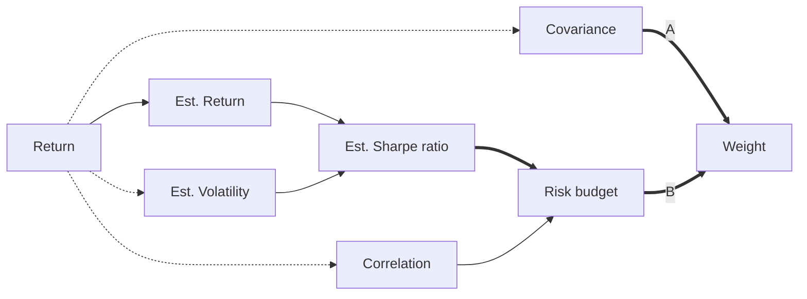

# Risk Parity and Budgeting

[TOC]

## Introduction

> [**Risk parity**](https://en.wikipedia.org/wiki/Risk_parity)  (or **risk premia parity**) is an approach to investment portfolio management which focuses on allocation of risk, usually defined as volatility, rather than allocation of capital. The risk parity approach asserts that when asset allocations are adjusted (leveraged or deleveraged) to the same risk level, the risk parity portfolio can achieve a higher Sharpe ratio and can be more resistant to market downturns than the traditional portfolio.

Reference book: [Roncalli, Thierry - Introduction to Risk Parity and Budgeting](https://www.crcpress.com/Introduction-to-Risk-Parity-and-Budgeting/Roncalli/p/book/9781482207156)

### Risk measures

#### Properties

* Coherency
* Convexity

#### Common risk measures

* Volatility (standard deviation-based risk measure)
* Value-at-risk
* Expected shortfall

*Here we use volatility as risk measures.*

### Risk Contribution

Let $R(x)$ be the risk measure of portfolio $x=(x_1,\dots,x_n)$. The **risk contribution (RC)** of asset $i$ is defined as
$$
RC_i=x_i\frac{\part R(x)}{\part x_i}
$$
and
$$
R(x)=\sum_{i=1}^{n}x_i\frac{\part R(x)}{\part x_i}=\sum_{i=1}^{n}RC_i
$$

When
$$
R(x)=\sigma(x)=\sqrt{x^T\Sigma x}
$$
we have **marginal risk contribution (MRC)**
$$
MRC_i\equiv\frac{\part\sigma(x)}{\part x_i}=\frac{\Sigma x}{\sqrt{x^T\Sigma x}}
$$
and hence
$$
RC_i=x_i\frac{(\Sigma x)_i}{\sqrt{x^T\Sigma x}}
$$

For an **equally weighted risk contribution (ERC) portfolio**
$$
RC_i(x_1,\dots,x_n)=\frac{1}{n}
$$

When consider a set of given risk budgets $\{B_1,\dots,B_n\}$, the **risk budgeting (RB) portfolio**  is defined by

$$
RC_i(x_1,\dots,x_n)=B_i
$$

### Risk Budgeting Portfolio

#### Specification

$$
\begin{cases}
	RC_i(x)=b_iR(x) \\
	b_i\ge0 \\
	x_i\ge0 \\
	\sum_{i=1}^nb_i=1 \\
	\sum_{i=1}^nx_i=1
\end{cases}
$$

#### Numerical solutions

Optimize
$$
x^*=argminR(x) \\
u.c. \sum_{i=1}^nb_i\ln x_i\ge c
$$
with $c$ an arbitrary constant such that $c <\sum_{i=1}^nb_i\ln x_i
$.

*Here the optimization problem is realized in MATLAB using [fmincon](https://www.mathworks.com/help/optim/ug/fmincon.html) function.*

## Problems

1. ERC portfolios have high Sharpe ratio (~1.4) with relatively low annual return (~4%), which may not meet the expectation from customers.
2. Due to their low volatility and risk, bonds usually takes up a large portion in ERC portfolios (~70-80%), which may limit the performance of the portfolio.
3. Quantitative methods to determined the risk budget for RB portfolios.

## Optimality

> Maillard *et al.* (2010) show that the ERC portfolio corresponds to the tangency portfolio when the correlations are the same and when the assets have the same Sharpe ratio.

**Maximize Sharpe ratio (SR)** gives
$$
\frac{\part SR}{\part x_i}
\equiv\frac{\part}{\part x_i}\left(\frac{\mu}{\sigma}\right)
=0
$$

then we have
$$
\frac{\part}{\part x_i}\left(\frac{\mu}{\sigma}\right)
=\frac{1}{\sigma ^2}\left(\sigma\frac{\part\mu}{\part x_i}-\mu\frac{\part\sigma}{\part x_i}\right)
=0
$$
and hence
$$
\frac{\frac{\part\sigma}{\part x_i}}{\frac{\part\mu}{\part x_i}}=\frac{\mu}{\sigma}\equiv const.
$$

As
$$
\mu=\sum_{i=1}^n x_i\mu_i
$$

we have
$$
\frac{\part\mu}{\part x_i}=\mu_i
$$
Therefore
$$
\label{eq1}\tag{1}
\frac{MRC_i}{\mu_i}=\frac{\frac{\part\sigma}{\part x_i}}{\mu_i}\equiv const.
$$
**RB portfolio** gives
$$
RC_i(x)=b_iR(x)
$$
which can be written as
$$
\label{eq2}\tag{2}
\frac{RC_i}{b_i}=\frac{x_iMRC_i}{b_i}=const.
$$

From Eq.$\eqref{eq1}$ and Eq.$\eqref{eq2}$ we have
$$
\label{eq3}\tag{3}
\frac{x_i\mu_i}{b_i}=const.
$$
When
$$
R(x)=\sigma(x)=\sqrt{x^T\Sigma x}
$$
we have
$$
\label{eq4}\tag{4}
MRC_i=\frac{\part\sigma(x)}{\part x_i}=\frac{\sigma_i\sum_{j=1}^{n}\rho_{ij}\sigma_jx_j}{\sigma(x)}
$$
Combine Eq.$\eqref{eq1}$ and Eq.$\eqref{eq4}$ we have
$$
\label{eq5}\tag{5}
\frac{\sum_{j=1}^{n}\rho_{ij}\sigma_jx_j}{SR_i}
=\frac{\sum_{j=1}^{n}\rho_{ij}\sigma_jx_j}{\frac{\mu_i}{\sigma_i}}=const.
$$
Use Eq.$\eqref{eq2}$ and Eq.$\eqref{eq5}$ to eliminate $x_i$
$$
\frac{\sum_{j=1}^{n}\rho_{ij}\sigma_j\frac{b_j}{\mu_j}}{SR_i}=const.
$$
Hence
$$
\label{eq6}\tag{6}
\sum_{j=1}^{n}\frac{\rho_{ij}}{SR_j}b_j\propto SR_i
$$
which is equivalent to solving the system of linear equations
$$
\label{eq7}\tag{7}
\begin{pmatrix}
\frac{\rho_{11}}{SR_1} & \frac{\rho_{12}}{SR_2} & \dots & \frac{\rho_{1n}}{SR_n} \\
\frac{\rho_{21}}{SR_1} & \frac{\rho_{22}}{SR_2} & \dots & \frac{\rho_{2n}}{SR_n} \\
\vdots & \vdots & \ddots & \vdots\\
\frac{\rho_{n1}}{SR_1} & \frac{\rho_{n2}}{SR_2} & \dots & \frac{\rho_{nn}}{SR_n} \\
\end{pmatrix}

\begin{pmatrix}
b_1 \\ b_2 \\ \vdots \\ b_n
\end{pmatrix}

=\begin{pmatrix}
SR_1 \\ SR_2 \\ \vdots \\ SR_n
\end{pmatrix}
$$

Note that $\rho_{ii}=1$ and $\rho_{ij}=\rho_{ji}$ for any $i$, $j$.

**The solution $\{b_1, b_2, \dots, b_n\}$ maximize RB portfolio's Sharpe ratio.**

When $\rho_{ij}=0$ for any $i\ne j$, from Eq.$\eqref{eq6}$ we have
$$
\label{eq8}\tag{8}
b_i\propto SR_i^2
$$

## MATLAB Realization

### Process Flow

Two parameters are needed for the Risk Budgeting portfolio. One is risk budget for each asset, the other is covariance matrix to compute weight from risk budget.  We are going to test three ways of setting the risk budget:

* **Equally weighted risk contribution (ERC) portfolio**

  Risk budget for each asset is equal

* **Squared Sharpe ratio (SRS) portfolio**

  Risk budget is proportional to squared Sharpe ratio as from  Eqs.$\eqref{eq8}$.

* **Max Sharpe ratio (maxSR) portfolio**

  Risk budget is the solution of Eqs.$\eqref{eq7}$ , which maximize portfolio's Sharpe ratio

We have known that the portfolio is insensitive to covariance, which is a main property of ERC portfolio. Estimated Sharpe ratio of each asset is needed for both SRS and maxSR portfolio. In addition, correlation matrix is required for maxSR portfolio.

 

*As mentioned, the portfolio is insensitive to covariance. We use covariance of daily return from the past N months to compute  covariance. We tested with $N=1,2,4,6,8,10,12$, and it shows not much difference, which verified the insensitivity, and we use $N=4$ in the following backtesting.*

### Data

We get daily return of Wind A-Shares, S&P 500, China Treasury Bond Index, Nanhua Commodity Index, AU9999 and Hang Seng Index during the period of 12/01/2004 to 08/05/2019 from [Wind Information](https://www.wind.com.cn/en/default.html).

[[*Original data*]()]

The following figure shows the net value of the 6 assets mentioned above from 12/01/2004 to 08/01/2019.

Backtestings are performed during the time period from 12/01/2009 to 08/05/2009.

## SRS & maxSR

* Covariance - covariance of daily return from the past 4 months
* Est. Return - mean of daily return from the past N months
* Est. Volatility - standard deviation of daily return from the past N months
* Correlation (for maxSR) - correlation of daily return from the past N months

* $N=1,2,4,6,8,10,12$

|                | 'erc' | 'srs_1' | 'srs_2' | 'srs_4' | 'srs_6' | 'srs_8' | 'srs_10' | 'srs_12' |
| -------------- | ----- | ------- | ------- | ------- | ------- | ------- | -------- | -------- |
| Annual Ret (%) | 4.89  | 4.90    | 6.43    | 5.36    | 5.05    | 4.29    | 4.30     | 4.98     |
| Annual Vot (%) | 3.38  | 4.43    | 5.03    | 5.48    | 4.15    | 3.75    | 3.94     | 3.73     |
| Sharpe Ratio   | 1.45  | 1.11    | 1.28    | 0.98    | 1.22    | 1.14    | 1.09     | 1.33     |
| Max DD (%)     | 4.13  | 5.68    | 4.28    | 8.05    | 4.78    | 3.61    | 5.45     | 4.04     |

[[srs_nm.m]()]

|                | 'erc' | 'mSR1' | 'mSR2' | 'mSR4' | 'mSR6' | 'mSR8' | 'mSR10' | 'mSR12' |
| -------------- | ----- | ------ | ------ | ------ | ------ | ------ | ------- | ------- |
| Annual Ret (%) | 4.89  | 4.69   | 6.83   | 7.12   | 8.48   | 7.13   | 6.09    | 8.91    |
| Annual Vot (%) | 3.38  | 8.44   | 8.42   | 9.89   | 8.69   | 9.43   | 9.25    | 9.18    |
| Sharpe Ratio   | 1.45  | 0.56   | 0.81   | 0.72   | 0.98   | 0.76   | 0.66    | 0.97    |
| Max DD (%)     | 4.13  | 15.35  | 12.62  | 16.18  | 15.88  | 18.96  | 14.50   | 13.70   |

[[maxSR_cost.m]()]

As we can see from the backtesting, squared Sharpe ratio (SRS) portfolio has higher return than the ERC portfolio. When time window N is large, SRS portfolio has similar performance with the ERC portfolio.

Mathematically SRS portfolio is a generalization of  ERC portfolio,  and SRS shows similar property of ERC - high (>1) Sharpe Ratio and low volatility, while have better return.

## Momentum Effect

Here we incorporate the momentum effect into the SRS portfolio. If the Est. Return of an asset is negative, then we set the weight of that asset as 0. It means that the weights are distributed among the assets who have positive Est. Return and Sharpe ratio. If all assets have negative Sharpe ratio, we set weight of China Treasury Bond Index as 1.

Th original momentum portfolio use return instead of Sharpe ratio in SRS portfolio to allocate weight among asset. We can imagine that by bringing volatility in, we have a more stable portfolio. To test this, in addition to SRS portfolio with momentum effect, we test portfolio of risk budget proportional to Sharpe ratio (instead of squared Sharpe ratio) with momentum effect, here we call it Sharpe ratio budget (SRB) portfolio.

* Covariance - covariance of daily return from the past 4 months
* Est. Return - mean of daily return from the past N months
* Est. Volatility - standard deviation of daily return from the past N months
* Correlation (for maxSR) - correlation of daily return from the past N months

* $N=1,2,4,6,8,10,12$

SRB portfolio with momentum effect

|                | 'erc' | 'srb-1' | 'srb-2' | 'srb-4' | 'srb-6' | 'srb-8' | 'srb-10' | 'srb-12' |
| -------------- | ----- | ------- | ------- | ------- | ------- | ------- | -------- | -------- |
| Annual Ret (%) | 4.89  | 8.01    | 6.80    | 7.31    | 7.10    | 6.53    | 6.09     | 5.81     |
| Annual Vot (%) | 3.38  | 9.37    | 8.11    | 7.72    | 5.87    | 5.58    | 6.23     | 6.50     |
| Sharpe Ratio   | 1.45  | 0.86    | 0.84    | 0.95    | 1.21    | 1.17    | 0.98     | 0.89     |
| Max DD (%)     | 4.13  | 10.49   | 10.73   | 10.62   | 5.10    | 6.31    | 10.26    | 10.26    |

[[srb.m]()]

SRS portfolio with momentum effect

|                | 'erc' | 'srsm1' | 'srsm2' | 'srsm4' | 'srsm6' | 'srsm8' | 'srsm10' | 'srsm12' |
| -------------- | ----- | ------- | ------- | ------- | ------- | ------- | -------- | -------- |
| Annual Ret (%) | 4.89  | 8.25    | 7.82    | 7.40    | 7.01    | 6.08    | 6.50     | 6.24     |
| Annual Vot (%) | 3.38  | 10.34   | 9.85    | 8.91    | 6.81    | 6.22    | 6.58     | 6.91     |
| Sharpe Ratio   | 1.45  | 0.80    | 0.79    | 0.83    | 1.03    | 0.98    | 0.99     | 0.90     |
| Max DD (%)     | 4.13  | 10.48   | 12.45   | 10.42   | 8.06    | 9.08    | 10.37    | 10.23    |

[[srs_cost.m]()]

## Volatility Predicted by GARCH

Here we incorporate the momentum effect into the SRS and maxSR portfolio. If the Est. Return of an asset is negative, then we set the weight of that asset as 0. It means that the weights are distributed among the assets who have positive Est. Return and Sharpe ratio. If all assets have negative Sharpe ratio, we set weight of China Treasury Bond Index as 1.

* Covariance - covariance of daily return from the past 4 months
* Est. Return - mean of daily return from the past N months
* Est. Volatility - standard deviation of 1 month prediction of GARCH(1,1) model on past 48 months

* $N=1,2,4,6,8,10,12$

SRS model with GARCH

|                | 'erc' | 'srsv-1' | 'srsv-2' | 'srsv-4' | 'srsv-6' | 'srsv-8' | 'srsv-10' | 'srsv-12' |
| -------------- | ----- | -------- | -------- | -------- | -------- | -------- | --------- | --------- |
| Annual Ret (%) | 4.89  | 5.38     | 6.66     | 5.99     | 5.09     | 4.48     | 4.42      | 5.10      |
| Annual Vot (%) | 3.38  | 4.96     | 5.60     | 5.97     | 4.34     | 3.85     | 4.04      | 3.83      |
| Sharpe Ratio   | 1.45  | 1.08     | 1.19     | 1.00     | 1.17     | 1.16     | 1.10      | 1.33      |
| Max DD (%)     | 4.13  | 6.15     | 3.55     | 6.73     | 5.18     | 4.15     | 5.66      | 4.02      |

[[srs_volt_nm.m]()]

SRB model with momentum effect and GARCH

|                | 'erc' | 'srbv1' | 'srbv2' | 'srbv4' | 'srbv6' | 'srbv8' | 'srbv10' | 'srbv12' |
| :------------- | ----- | ------- | ------- | ------- | ------- | ------- | -------- | -------- |
| Annual Ret (%) | 4.89  | 8.20    | 7.23    | 7.60    | 7.10    | 6.66    | 6.03     | 5.87     |
| Annual Vot (%) | 3.38  | 9.34    | 8.03    | 7.68    | 5.81    | 5.44    | 6.23     | 6.51     |
| Sharpe Ratio   | 1.45  | 0.88    | 0.90    | 0.99    | 1.22    | 1.23    | 0.97     | 0.90     |
| Max DD (%)     | 4.13  | 10.48   | 10.74   | 10.66   | 5.23    | 5.43    | 10.41    | 10.40    |

[[srb_volt.m]()]

SRS with momentum effect and GARCH

|                | 'erc' | 'srsmv1' | 'srsmv2' | 'srsmv4' | 'srsmv6' | 'srsmv8' | 'srsmv10' | 'srsmv12' |
| :------------- | ----- | -------- | -------- | -------- | -------- | -------- | --------- | --------- |
| Annual Ret (%) | 4.89  | 8.16     | 8.60     | 8.16     | 7.09     | 6.48     | 6.44      | 6.35      |
| Annual Vot (%) | 3.38  | 10.38    | 9.70     | 8.90     | 6.70     | 5.92     | 6.59      | 6.93      |
| Sharpe Ratio   | 1.45  | 0.79     | 0.89     | 0.92     | 1.06     | 1.10     | 0.98      | 0.92      |
| Max DD (%)     | 4.13  | 10.46    | 10.83    | 10.45    | 5.81     | 6.58     | 10.52     | 10.56     |

[[srs_volt.m]()]

## Appendix

### Correlation

